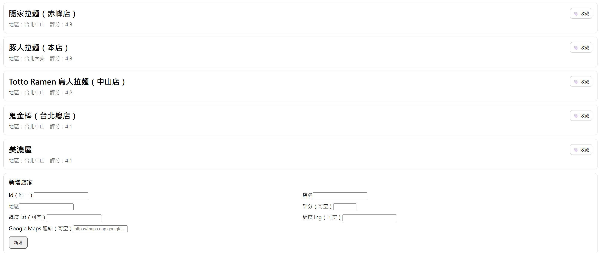
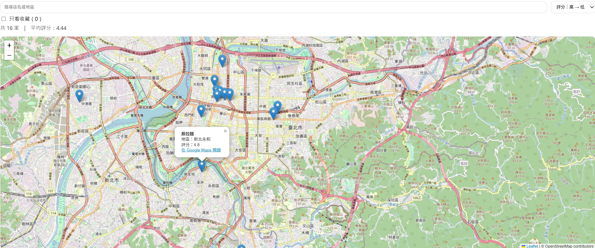

# 拉麵口袋名單 · Ramen Pocket List

> 一個把「想吃的拉麵店」從截圖與訊息裡救出來的地圖式清單工具。
> React + Vite + Leaflet，純前端、免登入、資料留在自己的瀏覽器裡，並可用 JSON 匯出入攜帶。

**🔗 線上試用：** https://yc1628.github.io/ramen-pocket-list/



---

## 這個工具解決什麼問題

想吃的店平常散落在 Google Maps 收藏、IG 限動截圖和朋友傳的訊息裡。等到真的站在中山站要決定吃哪一家時，沒有一個地方能同時回答「附近有哪幾家、評分多少、我收藏過嗎」。

現有做法各有缺口：Google Maps 我的地圖不能自訂欄位也不好排序；Notion 表格看得到資料但看不到位置關係；Excel 兩者皆無。

所以我做了一個**清單與地圖同步呈現**的小工具——列表負責篩選與排序，地圖負責回答「哪家離我近」。內建 16 家台北／新北的口袋名單作為預設資料，使用者可以自由增修成自己的版本。

---

## 功能

| 功能 | 說明 |
|---|---|
| 🔍 即時搜尋 | 同時比對店名與地區，輸入即篩選 |
| ↕️ 多重排序 | 評分高→低、低→高、店名（依 `localeCompare` 正確處理中文排序） |
| 💖 收藏 | 標記與「只看收藏」過濾，收藏狀態寫入 localStorage |
| 🗺️ 地圖檢視 | Leaflet + OpenStreetMap，標記點擊顯示店名、地區、評分與 Google Maps 連結 |
| ➕ 新增／編輯／刪除 | 使用者自建店家可完整編輯，**內建資料受保護不可刪改** |
| 📤 JSON 匯出入 | 匯出自建清單、匯入時依 id 合併並回報新增／覆蓋筆數 |
| 📊 即時統計 | 顯示目前篩選結果的家數與平均評分 |



---

## 幾個實作上的決定

### 為什麼不做後端

這是單人使用的清單工具，加上帳號系統只會增加使用門檻卻不帶來任何價值。資料存 `localStorage`，配合 JSON 匯出入解決換裝置的需求——使用者要帶走資料時拿到的是一個乾淨的陣列檔，不需要任何人的伺服器。

代價是資料綁在單一瀏覽器上，清除瀏覽資料會遺失。這是刻意接受的取捨，也是匯出功能存在的理由。

### 內建資料與使用者資料分離

`shop.json` 是唯讀的預設清單，使用者新增的店家存在 `localStorage` 的另一個 key，兩者在渲染前才合併：

```js
const allShops = useMemo(() => [...rawShops, ...userShops], [userShops]);
const userIds  = useMemo(() => new Set(userShops.map(s => s.id)), [userShops]);
```

刪除與編輯前都會檢查 `userIds`，使用者動不到內建資料。這樣的好處是預設清單永遠可以透過更新 `shop.json` 來擴充，不會與使用者的修改衝突。

### 匯入時的防禦

匯入是唯一接受外部輸入的入口，所以做了三層處理：先確認解析結果是陣列、再逐筆做型別正規化（`rating`／`lat`／`lng` 非數字一律轉 `null`）、最後過濾掉缺少 `id` 或 `name` 的項目。合併採 id 覆蓋策略，完成後回報新增與覆蓋筆數，讓使用者知道到底發生了什麼：

```js
const { list, added, replaced } = mergeUserShops(cleaned);
```

### 狀態管理沒有用 Redux

全域狀態只有 5 個（搜尋字串、排序方式、收藏清單、只看收藏、使用者店家），`useState` + `useMemo` 就足夠。引入狀態管理套件在這個規模只會增加理解成本。派生資料（篩選結果、平均評分、id 集合）全部用 `useMemo` 計算，避免每次 render 重算。

---

## 技術棧

- **React 19** — 函式元件與 Hooks
- **Vite 7** — 開發伺服器與打包，使用 SWC 版的 React plugin
- **Leaflet 1.9 / react-leaflet 5** — 地圖與標記
- **OpenStreetMap** — 圖磚來源（無 API key、無用量限制）
- **localStorage** — 持久化
- **GitHub Actions** — push 到 main 自動建置並部署至 GitHub Pages

---

## 專案結構

```
src/
├── App.jsx                  # 狀態管理、篩選排序邏輯、版面組裝
├── components/
│   ├── ShopCard.jsx         # 店家卡片，內含行內編輯模式
│   ├── ShopForm.jsx         # 新增店家表單
│   ├── MapView.jsx          # Leaflet 地圖與標記
│   └── ImportExport.jsx     # JSON 匯出入與資料清洗
├── utils/
│   ├── storage.js           # 收藏狀態的讀寫
│   └── db.js                # 使用者店家的 CRUD 與合併
└── data/
    └── shop.json            # 內建 16 家預設清單
```

`storage.js` 與 `db.js` 都把 `localStorage` 的存取包在 try/catch 內並回傳預設值，避免在無痕模式或配額已滿時整個應用崩潰。

---

## 本機執行

```bash
git clone https://github.com/yc1628/ramen-pocket-list.git
cd ramen-pocket-list

npm install
npm run dev          # http://localhost:5173

npm run build        # 產生 dist/
npm run preview      # 預覽正式版打包結果
```

需要 Node.js 18 以上。

---

## 資料格式

`shop.json` 與匯出的 JSON 皆為同一格式，可直接互換：

```json
{
  "id": "r1",
  "name": "隱家拉麵（赤峰店）",
  "area": "台北中山",
  "rating": 4.3,
  "lat": 25.056523584563635,
  "lng": 121.52043909368555,
  "mapUrl": "https://maps.app.goo.gl/..."
}
```

`id` 必須唯一（新增時會檢查衝突）。`rating`、`lat`、`lng`、`mapUrl` 皆可為空——沒有座標的店家不會出現在地圖上，但仍會列在清單中。

---

## 已知限制

- 資料僅存於單一瀏覽器的 localStorage，清除瀏覽資料會遺失（故提供 JSON 匯出）
- 地圖中心固定為第一筆有座標的店家，尚未支援定位或「離我最近」排序
- 樣式使用行內 style，元件數量再成長就該抽成 CSS Module 或導入 Tailwind
- 尚未撰寫測試；`db.js` 的合併邏輯與 `ImportExport` 的資料清洗是最該補測試的兩處
- 新增店家需手動填入經緯度，尚未串接地址轉座標（geocoding）

---

## 後續規劃

- 串接 Nominatim 做地址轉座標，免去手動查經緯度
- 加入標籤系統（豚骨／雞白湯／沾麵）與多標籤篩選
- 以 Geolocation API 支援「依距離排序」
- 用 Vitest 補上 `db.js` 與匯入清洗邏輯的單元測試
- 將 `alert` / `confirm` 換成自訂 Toast 與對話框

---

## 授權

MIT License — 詳見 [LICENSE](LICENSE)。

店家評分為個人主觀紀錄，與任何店家或平台無關。
